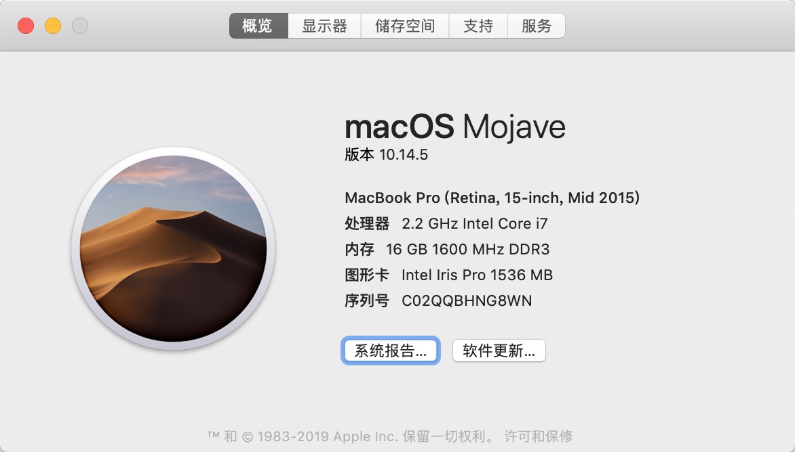
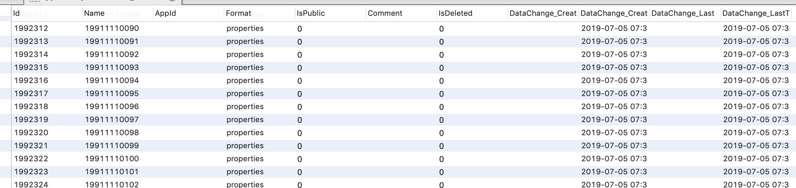
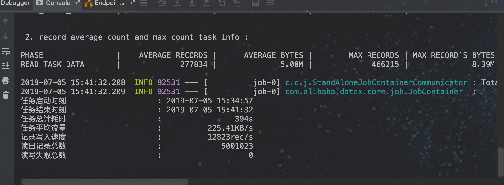

## ETL WEB 版本

### vue 使用方式
##### 修改启动的端口 

找到 `vue.config.js` 修改 `proxy` 里的属性即可

##### Build Setup

运行 

```
npm install
```

打包

```
npm run build:prod
```

####
将打包后文件单独部署或拷贝到datax-web static 目录下与jar包一起运行均可


### 使用方式
#### 1. 在父工程目录下使用maven打包
```
 mvn -U clean package assembly:assembly -Dmaven.test.skip=true 
```

#### 2. 在打包完成的target目录下进入datax-web，可以看到skycloud-datax-web-0.0.1-SNAPSHOT
```
cd  datax/datax/plugin/web
```

#### 3. 运行启动命令
```
 java  -Ddatax.home=当前目录/target/datax/datax  -jar skycloud-datax-web-0.0.1-SNAPSHOT.jar

 或者 通过启动脚本启动
 打完包后的 bin/start.sh
```
需要配上环境变量-Ddatax.home，此处参照上述配置mvn打包后的目录即可


### 4. 测试
#### 前提条件:

##### 系统信息:


##### (数据库类型:mysql 数据大小: 561M 数据条数:500W 数据格式如下:)



##### 相同数据库实例(不同库数据迁移)


[详细日志请点我](doc/3_1562312097720)

##### job配置
```
{
  "job": {
    "setting": {
      "speed": {
        "channel": 3
      },
      "errorLimit": {
        "record": 0,
        "percentage": 0.02
      }
    },
    "content": [
      {
        "reader": {
          "name": "mysqlreader",
          "parameter": {
            "username": "root",
            "password": "123456",
            "column": [
              "id",
              "Name"
            ],
            "splitPk": "id",
            "connection": [
              {
                "table": [
                  "appnamespace"
                ],
                "jdbcUrl": [
                  "jdbc:mysql://127.0.0.1:3306/datax_test"
                ]
              }
            ]
          }
        },
        "writer": {
          "name": "mysqlwriter",
          "parameter": {
            "writeMode": "insert",
            "username": "root",
            "password": "123456",
            "column": [
              "id",
              "Name"
            ],
            "session": [
              "set session sql_mode='ANSI'"
            ],
            "preSql": [
              "delete from appnamespace"
            ],
            "connection": [
              {
                "jdbcUrl": "jdbc:mysql://127.0.0.1:3306/datax_test1",
                "table": [
                  "appnamespace"
                ]
              }
            ]
          }
        }
      }
    ]
  }
}
```
### 5. 运维平台界面


### 6. 来源(20190705)
https://github.com/alibaba/DataX/